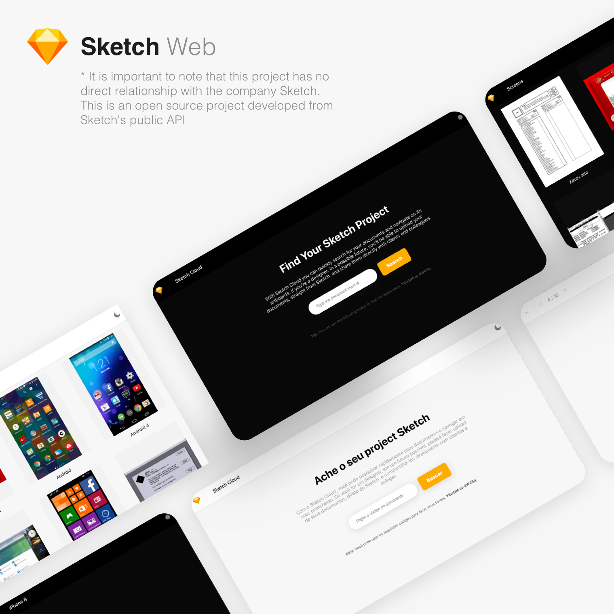

<div align="center">
<!--    -->
</div>

---

## 🏃🏽‍♀️ How to install & run it

This project was built using as base the [Create React App](https://reactjs.org/docs/create-a-new-react-app.html) toolchain; so you can use every script that is available on it.

After downloading the project from Github, you only need to:

```sh
$ yarn install
$ yarn start
# or
$ npm install
$ npm start
```

Then, you'll get a working version of *Sketch Web* running in your port 3000 (or in any other if the first one was already taken).

---

## ℹ️ WIP

I just started to work on it but I'll provide more info about it soon.

---

## 🎉 Contributors

Made with love ❤️ and coffee ☕️ by [Rafael Câmara](https://www.linkedin.com/in/rafaelcamaram/).
